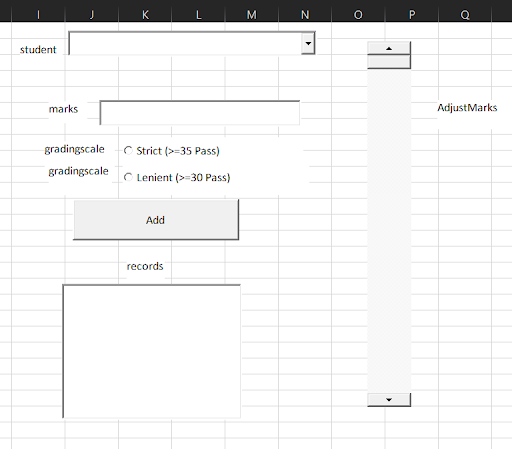

# Student Marks Data Entry System

This project contains a VBA-driven data entry interface built directly onto an Excel Worksheet using ActiveX controls. It allows users to input student marks, evaluate them against a strict or lenient grading scale, and append the results to a database sheet.

> **Note on UI Layout:** The spatial arrangement of the controls shown in the screenshot is strictly for demonstration. You may design and position the interface however you prefer on your worksheet, provided the exact Control Types and `(Name)` properties listed below are used.

## Architecture Warning
This tool utilizes ActiveX controls embedded on the worksheet grid. The code provided in the `.bas` file must be placed in the specific **Worksheet Module** (e.g., `Sheet1`), not in a standard module. This is because the code relies on the `Me` keyword to reference the worksheet's specific controls.

## UI Setup and Control Mapping

To replicate this tool, you must enable the **Developer Tab** in Excel, click **Insert**, and select the corresponding **ActiveX Controls**. 

You must open the **Properties Window** (F4) for each control and change the `(Name)` property to match the exact names listed below. If these names do not match, the VBA code will throw a compilation error.

| Control Type | Required `(Name)` | Purpose |
| :--- | :--- | :--- |
| **ComboBox** | `cmbStudent` | Select or type the student's name. |
| **TextBox** | `txtMarks` | Displays and accepts the numeric score. |
| **ScrollBar** | `scrMarks` | Allows scrolling to adjust the marks in the TextBox. |
| **OptionButton** | `optStrict` | Sets the passing threshold to 35. |
| **OptionButton** | `optLenient` | Sets the passing threshold to 30. |
| **CommandButton** | `btnAdd` | Executes the validation and database append logic. |
| **ListBox** | `lstRecords` | Displays the historical log of entered marks. |

## Implementation Instructions

1. Create a primary interface worksheet and a second worksheet named exactly `DB`.
2. On your main interface sheet, enter **Design Mode** via the Developer Tab.
3. Right-click the worksheet tab and select **View Code**.
4. Paste the provided VBA code directly into this Worksheet Module. 
5. Exit **Design Mode** to activate the controls.

## Features
* **Dynamic Dropdown:** The `Worksheet_Activate` event uses a Scripting Dictionary to automatically extract and deduplicate student names from the `DB` sheet to populate the ComboBox.
* **Data Validation:** Prevents blank submissions, enforces numeric entry, and restricts ranges to 0-100.
* **Live UI Refresh:** The ListBox automatically updates to display the most recent database entries upon sheet activation.
