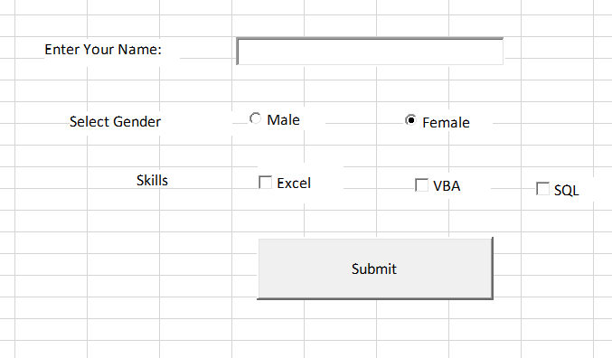

# User Registration and Skill Assessment Form

This project demonstrates a data collection interface built on an Excel Worksheet using ActiveX controls. It validates user text input, processes exclusive OptionButton selections, and concatenates multiple CheckBox boolean values into a single formatted output string.

## Architecture Warning
This script is designed for ActiveX controls embedded directly on a worksheet. The provided VBA code must be pasted into the specific **Worksheet Module** where the controls reside (e.g., `Sheet1`), not a standard module.

## UI Setup and Control Mapping

To replicate this interface, enable the **Developer Tab**, click **Insert**, and select the **ActiveX Controls**. Open the **Properties Window** (F4) for each control and assign the exact `(Name)` properties listed below to prevent compilation errors.

| Control Type | Required `(Name)` | Purpose |
| :--- | :--- | :--- |
| **TextBox** | `txtName` | Accepts the user's string input for their name. |
| **OptionButton** | `optMale` | Boolean toggle for Male gender selection. |
| **OptionButton** | `optFemale` | Boolean toggle for Female gender selection. |
| **CheckBox** | `chkExcel` | Boolean toggle for Excel skill. |
| **CheckBox** | `chkVBA` | Boolean toggle for VBA skill. |
| **CheckBox** | `chkSQL` | Boolean toggle for SQL skill. |
| **CommandButton** | `cmdSubmit` | Executes the validation, string concatenation, and output logic. |

## Features
* **Mandatory Field Validation:** Halts execution and alerts the user if the Name text box is left blank.
* **Dynamic String Formatting:** Evaluates multiple checkbox states, concatenates selected skills into a single string, and mathematically strips trailing delimiters before outputting the final summary.
